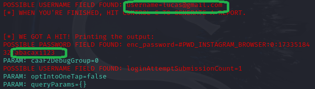

# Phishing para captura de credenciais do Instagram
Criar um site clone da página de login do Instagram para capturar credenciais do alvo.

### Ferramentas

- VM Kali Linux
- setookit


### Iniciando e configurando o Phishing no Kali

- Login root: <br>
- `$ sudo su `<br>

- Iniciando o setoolkit <br>
 `$ setoolkit`

- Tipo de ataque: ``` Social-Engineering Attacks ```
> O Ataque de Engenharia Social é voltado para manipular pessoas e induzi-las a revelar informações confidenciais, como senhas ou dados financeiros.


- Vetor de ataque: ``` Web Site Attack Vectors ```
> Ataque baseado em websites

- Método de ataque Web: ```Credential Harvester Attack Method ```
> Método usado em clones de servidores Web onde contém campos de login e senha, os dados desses campos são coletados e enviados para o Agente de Ameaça.

- Método de ataque: ``` Site Cloner ```
> Cria um clone do site informado para induzir a vítima pensar que é legítimo.

- Obtendo o endereço da máquina (Usado como o servidor do Agente de Ameaça que recebe as credenciais: <br>
`$ ifconfig `

- URL para clone: http://www.instagram.com 
> Site que será clonado.


### Resultado

